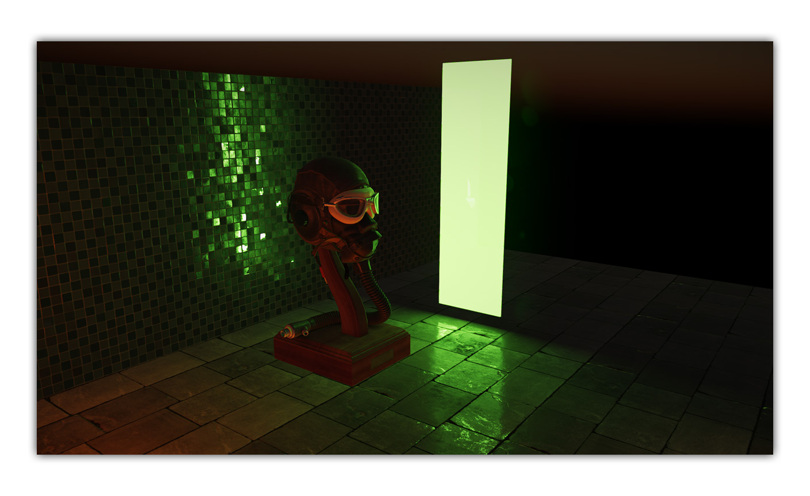
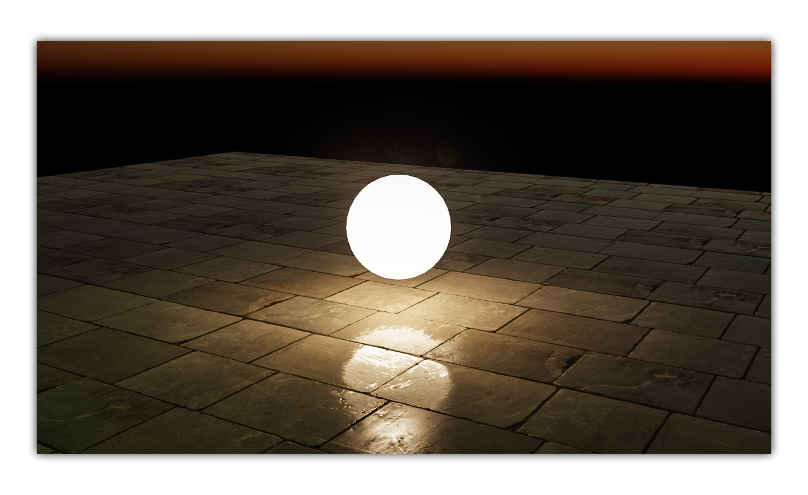
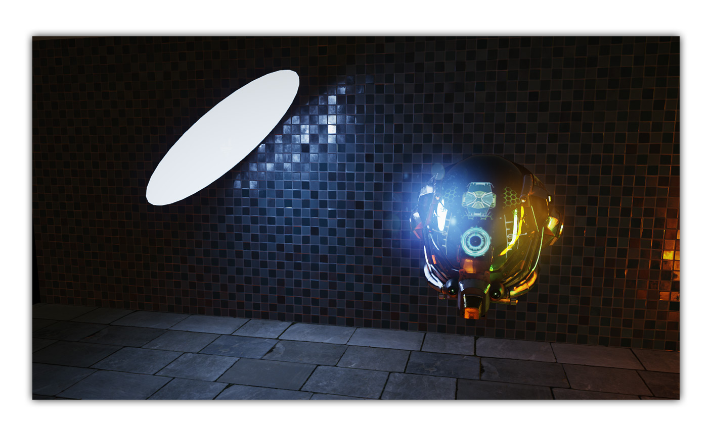
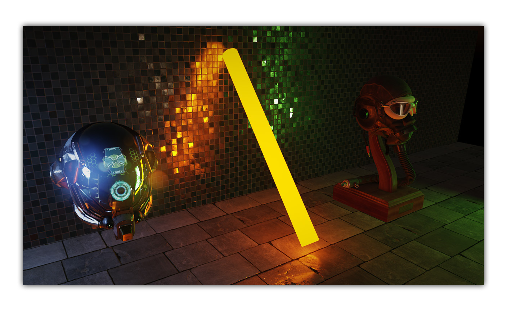

# Area Lights Demo

This demo uses the new Evergine Area Light capabilities to create special soft light effects.

Additionally, let checks the new PBR materials (Physically Based Rendering).

#### Rectangle Light

#### Sphere Light

#### Disk Light

#### Tube Light

## Build and Test

Required Visual Studio 2022 with .NET6 support.

### Special Keys
 * W,S,D,A: Camera movement.
 
----
Powered by **[Evergine](http://www.evergine.com)**

LET'S CONNECT!

- [Youtube](https://www.youtube.com/subscription_center?add_user=WaveEngineChannel)
- [Twitter](https://twitter.com/WaveEngineTeam)
- [Blog](http://geeks.ms/waveengineteam/)
